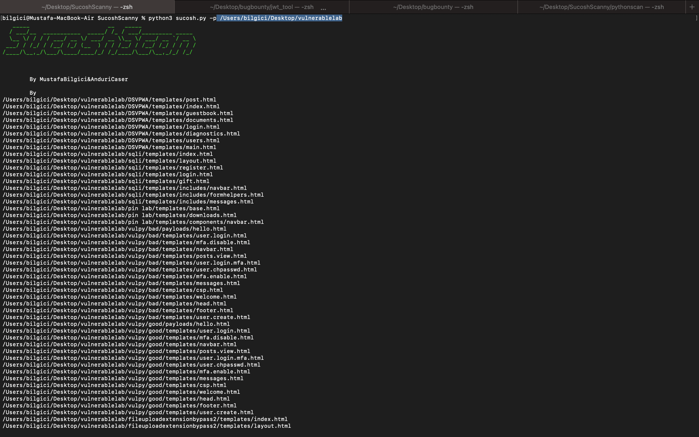

# Sucosh Scanny
"Sucosh" is an automated Source Code vulnerability scanner(SAST) and assessment framework for Python(Flask-Django) & NodeJs capable of performing code review in Web Application Developing or Source Code Analysis processes.It’s can detect a lot of vulnerability(RCE,SSTI,Insecure Deserilisation,SSRF,SQLI,CSRF etc.) in given source code.For now, only the detection modules of python(flask,django) and nodejs(express js.) languages are finished. In the future, specific detection functions will be written for php (Laravel, Codeigniter), .NET, Go and other languages.

## Example Usage

- Scan source code analysis For example: `python3 sucosh.py -p <entercodepath>`

## Screenshots

</img> 
</img> 

### Scaning

**Python**
- [x] Flask
- [x] Django

**Node Js.**
- [x] Express JS.

**Other Languages and Frameworks**
- There will be update soon

**RCE**
- [X] Find Danger Fuctions 
- [X] Find Mitigation Fuctions 
- [X] Tracking İnputs 

**LFI**

- [x] Find Danger Fuctions
- [x] Tracking İnputs

**SSTI**
- [x] Find Danger Fuctions 
- [x] Tracking İnputs 

**SSRF**
- [x] Find Danger Fuctions 
- [x] Tracking İnputs 

**CSRF**
- [x]  Check CSRF Token in HTML Forms

**Secret Detection**
- [x]  Check Secrets Data (AWS-Key etc.)

**SQLI**

- [x] Find String Concanations in SQL Structers
- [x] Find İnputs in source code

**CVE**
- [x]  Check Vulnerable Dependencies

**XSS**

***Reflected***
- [x] Find String Concanations in SQL Structers
- [x] Find İnputs every programming languages

***Stored***
- [ ] Find Danger Fuctions every programming languages
- [ ] Find İnputs every programming languages
- [ ] Find Mitigation Fuctions every programming languages

***DOM***
- [ ] Find Danger Fuctions DOM and every programming languages
- [ ] Find Mitigation Fuctions DOM every programming languages
- [ ] Find İnputs DOM every programming languages
- [ ] Find vulnerable Jquery versions

**Custom Rule Sets**
- [ ] Rule Set İntegration with YAML

### Web Features

** To Do Developer Teams**
- [ ] Admin Dashboard and Developers Dashboards
- [ ] Graphs for Severity All Vulnerabilities
- [ ] Listing Vulnerabilites
- [ ] Github or Gitlab Api Key integration 

## Contributors ✨

Thanks goes to these wonderful people :

<!-- ALL-CONTRIBUTORS-LIST:START - Do not remove or modify this section -->
<!-- prettier-ignore-start -->
<!-- markdownlint-disable -->
<table>
  <tbody>
    <tr>
      <td align="center"><a href="https://github.com/AnduriCaser"> <b>AnduriCaser</b></a> <a href="#TibetÖğünç" title="Tutorials">✅</a></td>
       <td align="center"><a href="https://github.com/MustafaBilgici"> <b>MustafaBilgici</b></a> <a href="#MustafaBilgici" title="Tutorials">✅</a></td>
      </tr>
      </tbody>
      <table>
